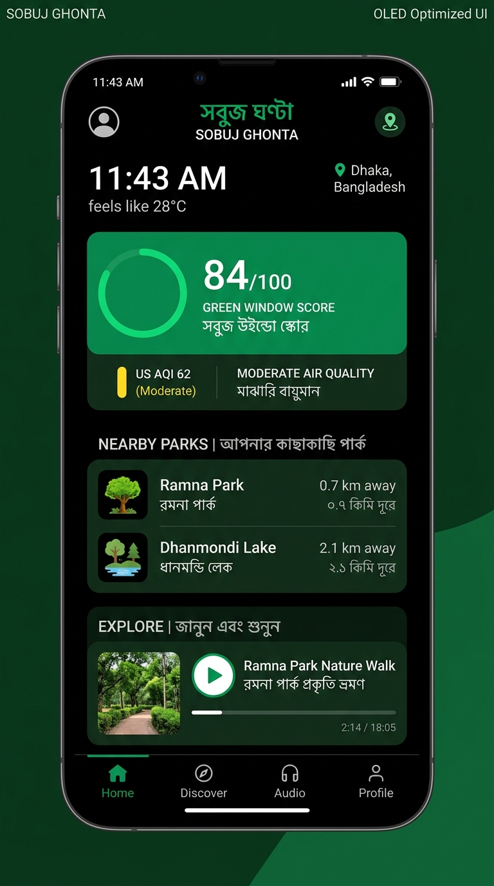

# Sobuj Ghonta (সবুজ ঘণ্টা) — The Green Hour

> **Ambient, screen-minimizing outdoor companion for safe urban green discovery.**  
> Built for the [DEV Hacktoberfest Open-Source AI Challenge Week 1: Touch Grass](https://dev.to/challenges/hacktoberfest-week1-2026-10-05).


---

## What is Sobuj Ghonta?

For over four billion people living in dense urban centers, "touching grass" isn't a 10-minute drive to an alpine hiking trail. In high-density cities like Dhaka, Kolkata, or Bangkok, nature is found in fragmented municipal parks, lakeside promenades, and pocket gardens—tucked behind concrete flyovers and heavy traffic.

To make matters harder, urban nature outings require navigating **environmental realities**: air quality spikes (US AQI > 150), tropical heat waves, intense midday UV radiation, sudden monsoon thunderstorms, and vector-borne mosquito seasons. Worse yet, conventional fitness and navigation apps do the opposite of helping you disconnect—bombarding you with screens, alerts, and map tapping.

**Sobuj Ghonta (সবুজ ঘণ্টা — "The Green Hour")** flips the script:
1. **Discovers Safe Urban Green Windows:** Computes a deterministic 0–100 hourly score combining real-time Open-Meteo AQI, PM2.5, apparent temperature, UV, rain/thunder, and golden hour windows.
2. **Finds Nearby Canopies:** Queries OpenStreetMap Overpass for parks, gardens, and lakesides within ~3 km, calculating walking distance and time.
3. **Generates Mindful Guided Walks:** Uses Google's open-weight **Gemma** model with strict code-level safety guardrails that AI cannot override (forcing gentle effort and N95 mask warnings when air is polluted).
4. **Puts the Phone in Your Pocket:** Delivers spoken voice narrations (bilingual Bengali & English) via a **cascading multi-tier TTS provider chain** (optional ElevenLabs with voice "Anika", Gemini 3.8 Flash TTS, open-weight Meta MMS-TTS, and browser Web Speech API fallback) with pre-cached audio for zero-signal trails. Features an **OLED pitch-black Pocket Mode** and lock-screen **Media Session API** controls so your phone stays stowed. (*Audio attribution: "Voice by ElevenLabs" when active*).
5. **Measures Screen Time Honestly:** Built-in **Page Visibility API meter** tracks the exact ratio of screen time vs. outdoor walking time, proving that the screen was the shortest part of your day.
6. **On-Device Nature Journal:** Preserves flower and leaf observations in **IndexedDB** on your personal device; photos are never stored server-side.

---

## 📱 Mobile UI



---

## ⚡ Zero-Key Instant Demo: "Demo: Dhaka"

You do **not** need an API key to evaluate Sobuj Ghonta. 

Click the **"Demo: Dhaka (Offline)"** button in the header:
- Instantly loads bundled real environmental telemetry from Dhaka (Ramna Park, Suhrawardy Udyan, Dhanmondi Lake, Chandrima Udyan, Gulshan Lake Park).
- Pre-generated bilingual walk scripts and high-fidelity audio clips play with **zero latency** and **zero network requests**.

---

## 🛡️ Honest Open Innovation: What Is Open vs. Closed

We believe in complete architectural transparency:

| Layer | Technology | License / Nature | Notes |
|---|---|---|---|
| **Core Reasoning** | **Gemma** (Google DeepMind) | Open Weights (Apache 2.0 / Gemma Terms) | Swappable between Google AI Studio (`gemma-4-26b-a4b-it`) and local **Ollama** (`gemma2:9b`) |
| **Environmental Data** | **Open-Meteo** | Open Data / Open Source API | 100% free, open weather & US EPA AQI data |
| **Geospatial Mapping** | **OpenStreetMap (Overpass)** | Open Data (ODbL) | Hyper-local green spaces, parks, and waterfronts |
| **Client & Server Code** | React 18, Vite 6, Express | **MIT License** | Completely open source |
| **User Data & Journal** | Browser **IndexedDB** | On-Device Local | Field notes & photos never leave your device |
| **ElevenLabs TTS (Optional)** | Voice "Anika" (`jUjRbhZWoMK4aDciW36V`) | Closed Hosted API (Free Tier) | Optional top tier if `ELEVENLABS_API_KEY` set. Free tier has no commercial license and requires attribution: **"Voice by ElevenLabs"**. App runs completely without it. |
| **Meta MMS-TTS** | `facebook/mms-tts-ben` & `eng` | Open Weights (CC-BY-NC 4.0) | Open-weight multi-lingual speech model run serverless |
| **Gemini TTS** | `gemini-3.8-flash-tts` | Hosted Developer API | Free-tier speech synthesis using the same Google AI Studio key as Gemma |
| **Browser TTS** | Web Speech API | Open Web Standard | 100% client-side, zero server dependencies |

*(Note: The entire application functions 100% without ElevenLabs. If no ElevenLabs key is present or quota is exhausted, it seamlessly cascades to Gemini TTS, open-weight Meta MMS, or browser speech).*

---

## 💻 Running Locally

### Prerequisites
- Node.js >= 20.0.0
- npm >= 10.0.0

### Quickstart
```bash
# 1. Clone repository
git clone https://github.com/SayemR0018/sobujGhonta.git
cd sobujGhonta

# 2. Install dependencies (server + client workspace)
npm install

# 3. Copy environment configuration
cp .env.example .env

# 4. Run test suite (27 unit & integration tests)
npm test

# 5. Run full verification pipeline (tests + build + smoke test)
npm run verify

# 6. Build and start production service
npm run build
npm start
```
Open [http://localhost:10000](http://localhost:10000) in your browser.

---

## 🦙 Run It Fully Local (Zero Cloud Dependencies)

You can run Sobuj Ghonta 100% offline using **Ollama** and browser Web Speech synthesis:

1. Install [Ollama](https://ollama.com/) and pull Gemma open weights:
   ```bash
   ollama pull gemma2:9b
   ```
2. Set your `.env`:
   ```env
   LLM_PROVIDER=ollama
   OLLAMA_URL=http://localhost:11434
   OLLAMA_MODEL=gemma2:9b
   TTS_PROVIDER=browser
   ```
3. Start the app:
   ```bash
   npm start
   ```
Now your environmental scoring, walk generation, and voice narrations run entirely on your local machine with zero external cloud subscriptions or API keys!

---

## 🚀 Deploying on Render

Sobuj Ghonta includes a ready-to-use Render Blueprint (`render.yaml`):

1. Fork or push this repository to GitHub.
2. In the [Render Dashboard](https://dashboard.render.com/), click **New +** → **Blueprint**.
3. Select `SayemR0018/sobujGhonta`.
4. Render will parse `render.yaml` and configure the unified web service.
5. (Optional) Provide `GEMMA_API_KEY` (which also powers Gemini TTS) or `HF_TOKEN`, or leave blank to run in 0-key demo and browser speech mode.

> **Note on Free-Tier Cold Starts:** On Render's free tier, the web service spins down after 15 minutes of inactivity. The initial wake-up request may take ~30–50 seconds. Once awake, response latency averages 50–100ms.

---

## 🧪 Automated Test Verification

All critical environmental algorithms, safety guardrails, and TTS fallback tiers are unit-tested:
```bash
npm test
```
```
▶ End-to-End Edge Case & Flow Tests (5 passed)
▶ ElevenLabs TTS Provider & Multi-Tier Cascade (8 passed)
▶ Safety Guardrails Engine (7 passed)
▶ Green Window Scoring Engine (6 passed)
▶ Free Text-to-Speech (TTS) Provider Chain & Caching (9 passed)
ℹ tests 35
ℹ suites 5
ℹ pass 35
ℹ fail 0
```

To test voice generation locally without exposing API keys:
```bash
npm run tts:test
# Or test with a default pre-made voice on free ElevenLabs accounts:
npm run tts:test -- --voice=21m00Tcm4TlvDq8ikWAM
```

---

## 📄 License

This project is licensed under the [MIT License](LICENSE) — Copyright (c) 2026 Sayem Rahman.